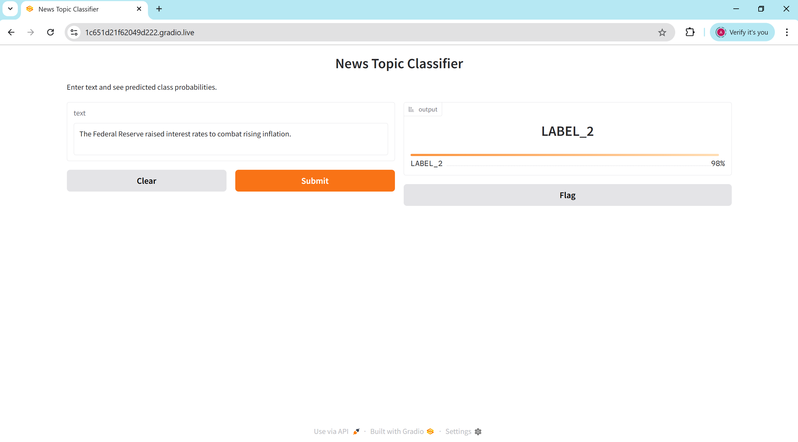

# 📰 News Topic Classification with BERT

## 📌 Problem Statement & Objective
The goal of this project is to build a **news topic classification system**.  
This involves training a model to accurately categorize news articles into **predefined classes** based on their textual content.

The project aims to:
- Leverage a **pre-trained transformer model (BERT)** and fine-tune it on the **AG News dataset**.
- Achieve **high classification performance** on unseen data.
- Demonstrate the **deployment of a trained model** for real-world usage.

---

## 🛠 Methodology / Approach

### 1️⃣ Library Installation
Installed necessary libraries:
- `transformers`
- `datasets`
- `torch`
- `scikit-learn`
- `gradio` / `streamlit` for deployment

### 2️⃣ Dataset Loading
- Used the **AG News dataset** from the `datasets` library.
- Accessed **training and testing splits** containing news articles and their corresponding category labels.

### 3️⃣ Data Preprocessing
- Tokenized the text using **bert-base-uncased** tokenizer.
- Applied padding & attention masks.
- Removed unnecessary columns and converted the dataset to **PyTorch tensors**.

### 4️⃣ Model Loading
- Loaded **BertForSequenceClassification** with pre-trained weights.
- Configured it for **4 output labels** (news categories).

### 5️⃣ Model Fine-Tuning
- Fine-tuned the BERT model on the **training dataset** using Hugging Face's `Trainer`.
- Specified training arguments like **learning rate, batch size, epochs**.

### 6️⃣ Model Evaluation
- Evaluated the fine-tuned model on the **test set**.
- Computed **accuracy** and **weighted F1-score** to measure performance.

### 7️⃣ Model Saving
- Saved the **fine-tuned model** and **tokenizer** locally for reuse.

### 8️⃣ Model Deployment
- Loaded the saved model & tokenizer.
- Deployed them as an **interactive web app** using **Gradio** for real-time text classification.

---

## 📊 Key Results

| Metric | Score |
|-------|------|
| **Accuracy** | 0.945 |
| **Weighted F1-score** | 0.945 |

✅ The model performs **strongly** in classifying news articles into the correct categories.

---

## 🖼 App Demo

Here’s what the News Topic Classifier looks like in action:

---

## 🏁 Final Summary / Insights
This project demonstrates:
- How to **fine-tune a BERT model** on a text classification dataset.
- The **end-to-end process**: installation, preprocessing, model training, evaluation, saving, and deployment.
- A practical **web-based news classifier** that can categorize articles interactively.

The fine-tuned model achieves **high accuracy** and **robust classification performance**, making it a solid baseline for news topic classification tasks.

---
